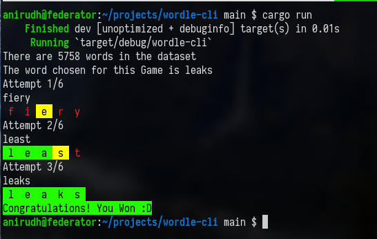

# wordle-rs

Wordle in the command line. Made fast with Rust.

WIP: Implementing a nice-looking terminal user interface.



## Setup Instructions

(make sure you have Rust installed.)

Clone this repo, and then run

```shell
$ cargo run
```
